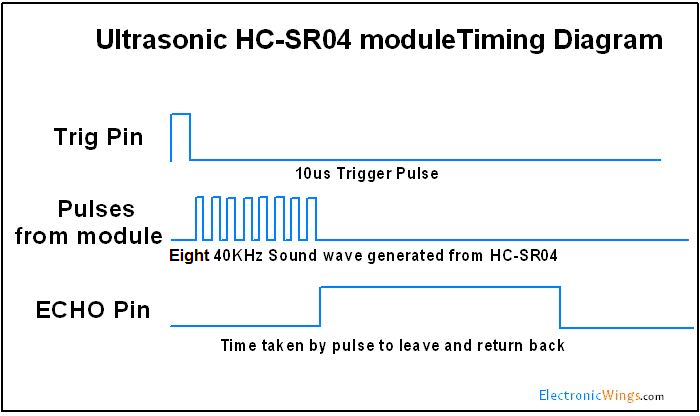

# HC-SR04 Ultrasonic Sensor Library for ESP32

A simple library for using HC-SR04 ultrasonic sensors with ESP32, featuring median filtering for improved accuracy.


## Hardware Connections

```
HC-SR04    ESP32
VCC    ->  5V
GND    ->  GND
Trig   ->  GPIO pin 
Echo   ->  GPIO pin
```

## Installation

1. Copy `hcsr04.h` and `hcsr04.c` to your project's components directory
2. Add `#include "hcsr04.h"` to your main file

## API Reference

### `float getDistance(uint8_t triggerPin, uint8_t echoPin, float maxDistance)`

Measures distance once from the HC-SR04 sensor.

**Parameters:**
- `triggerPin`: GPIO pin connected to Trig
- `echoPin`: GPIO pin connected to Echo
- `maxDistance`: Maximum desired distance (cm)

**Returns:**
- Distance in cm, or `-1` on error/timeout

### `float getDistanceMedian(uint8_t triggerPin, uint8_t echoPin, float maxDistance)`

Takes 3 measurements and returns the median value for improved accuracy.

**Parameters:**
- `triggerPin`: GPIO pin connected to Trig
- `echoPin`: GPIO pin connected to Echo  
- `maxDistance`: Maximum desired distance (cm)

**Returns:**
- Median distance in cm, or `-1` if all measurements fail

## How It Works

The HC-SR04 sensor operates using ultrasonic sound waves:

Trigger: Send a 10μs HIGH pulse to the Trig pin
Sound Generation: Sensor emits 8 bursts of 40kHz ultrasonic sound waves
Echo Detection: Echo pin goes HIGH when sound is emitted, LOW when echo is received
Distance Calculation: Time duration of echo pulse corresponds to distance

The sensor measures the time it takes for sound to travel to an object and back. Since sound travels at approximately 343 m/s, the distance formula becomes:
Distance (cm) = Echo pulse duration (μs) / 58