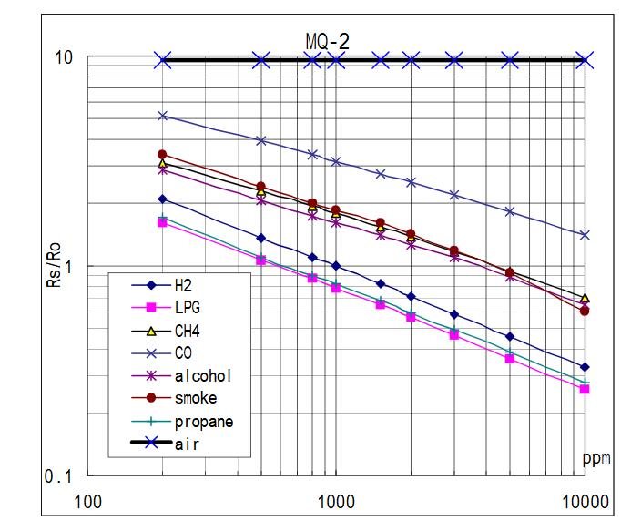

# MQ2 Gas Sensor Library for ESP-IDF

ESP32 library for MQ2 gas sensor. Measures CO, CH4 (methane), and smoke in PPM units.

## Installation

1. Download the `MQ2_ESPIDF` folder
2. Place it in your ESP-IDF project's `lib` directory
3. Include `#include "mq2.h"` in your main file

## Functions

### `mq2_init(int gpio_num, float rl_value, float ro_value)`

Initialize the MQ2 sensor.

**Parameters:**
- `gpio_num`: GPIO pin (supported: 32, 33, 34, 35, 36, 37, 38, 39)
- `rl_value`: Load resistance RL in kΩ (typically 5-20)
- `ro_value`: Reference resistance RO in kΩ (around 10K in clean air)
- `VCC`: 5V

### `readMQ2PPM(GasType gasType)`

Read gas PPM value from the sensor.

**Parameters:**
- `gasType`: Gas type (`CO`, `CH4`, `SMOKE`)

**Returns:** PPM value as float

**Example Usage:**
```c
#include "mq2.h"

void app_main() {
    // Initialize sensor on GPIO 34 with RL=10kΩ, RO=10kΩ
    mq2_init(34, 10.0, 10.0);
    
    while(1) {
        float co_ppm = readMQ2PPM(CO);
        float ch4_ppm = readMQ2PPM(CH4);
        float smoke_ppm = readMQ2PPM(SMOKE);
        
        printf("CO: %.2f PPM\n", co_ppm);
        printf("CH4: %.2f PPM\n", ch4_ppm);
        printf("Smoke: %.2f PPM\n", smoke_ppm);
        
        vTaskDelay(pdMS_TO_TICKS(2000));
    }
}
```

## Calculation



The relationship between Rs/Ro and PPM is a logarithmic function, used to determine the gas concentration (PPM) from the MQ2 sensor based on the ratio of the sensor's resistance in the presence of gas (Rs) to its resistance in clean air (Ro).

## Important Notes

- **Calibration**: Let sensor run in clean air for 60s->120s to determine accurate RO value (RL around 5-10kΩ, RO around 10-20kΩ)
- **Power**: MQ2 requires 5V for optimal operation
- **GPIO**: Only use supported ADC pins (32-39)

## Firebase Integration

If you want to send this data to Firebase, you can visit my Firebase library for ESP-IDF: https://github.com/buiTannn/Lib_Firebase_FreeRTOS

## Dependencies

- ESP-IDF framework
- ADC driver